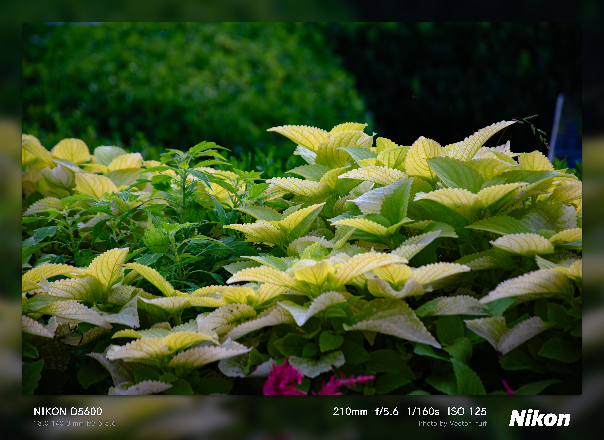
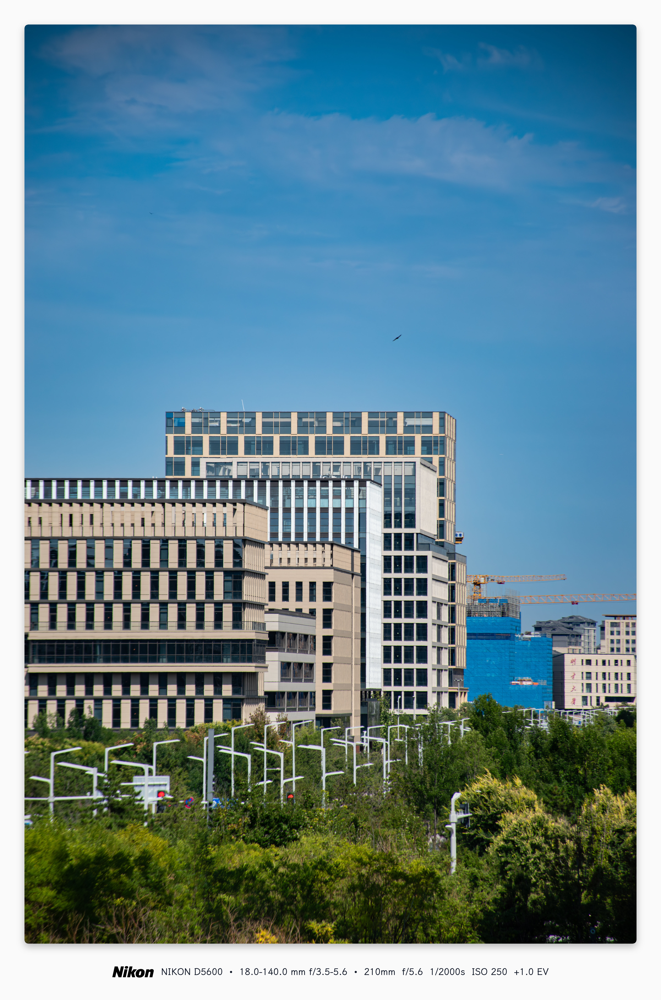

<div align="center">

# 📷 PhotoMark

**A modern, ultra-lightweight photo EXIF watermark & frame studio**  
*A modern, ultra-lightweight photo EXIF watermark & frame studio built with Tauri 2.0 and Rust.*

[](https://github.com/vectorfruit/photomark/actions/workflows/ci.yml)
[](https://www.gnu.org/licenses/gpl-3.0)
[](https://tauri.app)
[](https://www.rust-lang.org)
[](https://vitejs.dev)
[](https://www.typescriptlang.org)

</div>

> **Language / 语言:** [English](./README.en.md) | [中文](./README.md)

---

## 🌟 Why PhotoMark?

Most photo-framing tools on the market are built on heavy Electron architecture (often consuming 300MB+ of memory), or rely on external CLI pipelines such as Perl or ImageMagick, which are slow and fragile.

**PhotoMark** is a **Clean-Room** re-implementation built on **Tauri 2.0 + a pure Rust core** with a modern **WebKit/Canvas frontend**:

* 🚀 **Instant startup & ultra-low memory**: memory usage is around **25MB ~ 30MB** (about 90% lower than traditional tools).
* 🦀 **Pure Rust fast EXIF parsing**: uses `kamadak-exif` to extract camera body, lens, focal length, aperture, shutter speed, ISO and other core parameters with zero external dependencies.
* 🖼️ **Lossless original-quality pass-through**: bypasses double-compression loss and reads/redraws at 100% original resolution, supporting high-quality JPEG, lossless PNG (100%) and WebP.
* ⚡ **Multi-core parallel batch processing**: Rust `rayon` writes files with multi-threaded concurrency; hundreds of photos export in seconds.
* 🎨 **Advanced in-house frosted-glass & shadow engine**: multi-level pyramidal Gaussian blur combined with transparent photo drop shadows.

---

## ✨ Core Features

### 1. Four Beautiful Frame Templates
* **Classic Bottom Bar**: professional camera parameter bar with left/right columns and brand identity.
* **Gallery Border**: full-wrap gallery matting with an elegantly centered logo and parameters below.
* **Polaroid Instant**: retro white polaroid frame with typewriter-style parameters and vintage date stamp.
* **Minimal Badge**: a semi-transparent frosted glass pill floating in the bottom-right corner.

### 2. Frame Materials & Adjustable Frosted Glass
* **Material modes**: White frame, Dark frame, ✨ Frosted blur, and custom colors.
* **Adjustable blur**: in-house 3-Pass convolution blur engine with 15 ~ 150 depth gradient control.
* **Drop shadow & corner radius**: freely adjust photo shadow depth and rounded corners.

### 3. Camera Brand Vector Logo Auto-Matching
Built-in 20+ high-precision vector logos for mainstream camera and optics brands, automatically detected from EXIF and matched with light/dark variants:
* Sony, Canon, Nikon, Leica, Fujifilm
* Hasselblad, Panasonic, Olympus, DJI, Ricoh, Zeiss and more.

### 4. Excellent Human-Computer Interaction
* **Real-time progress bar**: Tauri 2.0 async event driven parsing and batch export progress dialogs.
* **Light & dark themes**: toggle between `☀️ Light Mode` and `🌙 Dark Mode`; preference persists.
* **🌐 i18n**: switch between Chinese and English; language preference persists.
* **UI scaling**: 80% ~ 150% UI scale for HiDPI 2K/4K displays and thin-and-light laptops.
* **One-click reset**: every slider has its own `↺` reset button, plus a global default reset.

---

## 🖼️ Showcase





---

## 📸 Supported Image Formats

* **Input**: `JPG` / `JPEG` / `PNG` / `WebP` / `TIFF` / `TIF` (desktop supports TIFF; browser preview mode supports JPG/PNG/WebP only)
* **Export**:
  * **JPEG**: quality 100% (maximum original quality), 95%, 90%, 85%
  * **PNG**: 100% pixel-perfect mathematical lossless
  * **WebP**: modern high-efficiency encoding

---

## 🛠️ Quick Start

### Prerequisites
* [Node.js](https://nodejs.org/) (>= 18) and [Yarn](https://yarnpkg.com/)
* [Rust](https://www.rust-lang.org/) (>= 1.80) and `cargo`
* Linux system dependencies (Arch Linux example):
  ```bash
  sudo pacman -S --needed webkit2gtk-4.1 gtk3 libsoup3 cairo gdk-pixbuf2 glib2
  ```

### Local Development & Debugging
```bash
# 1. Clone the repository
git clone https://github.com/vectorfruit/photomark.git
cd photomark

# 2. Install frontend dependencies
yarn install

# 3. Launch desktop dev mode (with hot reload)
yarn tauri dev
```

---

## 📦 Build & Distribution

### 1. Windows Installer (.exe / .msi)
On Windows (PowerShell or CMD):
```powershell
yarn install
yarn tauri build
# Output is located at src-tauri/target/release/bundle/nsis/ (installer + executable)
```

### 2. Arch Linux Native Packaging (PKGBUILD)
A standard `PKGBUILD` is included at the project root; run:
```bash
makepkg -sric
```

### 3. Linux AppImage Packaging
Run the built-in packaging script to produce a cross-distribution single-file AppImage following the [AppImage specification](https://docs.appimage.org):
```bash
./build-appimage.sh
# Output is located at dist-appimage/photomark-x86_64.AppImage
```

---

## 📂 Project Structure

```
photomark/
├── src-tauri/                 # Rust native backend
│   ├── src/
│   │   ├── exif_reader.rs     # Pure Rust EXIF parsing
│   │   ├── image_engine.rs    # Image decoding, lossless pass-through, Rayon batch processing
│   │   ├── commands.rs        # Tauri 2.0 IPC commands and progress event emitter
│   │   ├── models.rs          # Strongly typed data models
│   │   └── lib.rs             # Tauri plugins and lifecycle
│   ├── Cargo.toml             # Rust dependencies
│   └── tauri.conf.json        # Tauri app and window configuration
├── src/                       # Frontend interaction and rendering
│   ├── renderer/
│   │   ├── canvasRenderer.ts  # Core frame rendering engine (vector proportional scaling)
│   │   ├── blurEngine.ts      # In-house pyramidal Gaussian blur convolution
│   │   └── logoManager.ts     # Camera brand vector logo matching and caching
│   ├── main.ts                # Main controller (events, UI scale, theme switching)
│   ├── i18n.ts                # i18n dictionary and DOM translation helpers
│   ├── styles.css             # Modern light/dark design system
│   └── types.ts               # TypeScript interfaces
├── public/logos/              # 20+ high-precision brand vector SVGs
├── PKGBUILD                   # Arch Linux packaging definition
├── build-appimage.sh          # One-click AppImage packaging script
├── CONTRIBUTING.md            # Contributing guide (Chinese)
├── CONTRIBUTING.en.md         # Contributing guide (English)
├── LICENSE                    # GNU General Public License v3.0
└── README.md                  # Project documentation (Chinese)
   README.en.md                # Project documentation (English)
```

---

## ⚖️ Trademark Disclaimer

All camera brand names, logos and trademarks included in this software (including but not limited to Leica, Hasselblad, Sony, Canon, Nikon, Fujifilm, etc.) belong to their respective trademark owners. The project references these marks solely for EXIF metadata visualization and factual indication, with no commercial affiliation, dependency, or official endorsement.

---

## 🤝 Contributing

Issues and Pull Requests are welcome! See [CONTRIBUTING.en.md](./CONTRIBUTING.en.md) for details (or [CONTRIBUTING.md](./CONTRIBUTING.md) in Chinese).

---

## 📄 License

This project is open sourced under the **[GNU General Public License v3.0 (GPLv3)](LICENSE)**.
